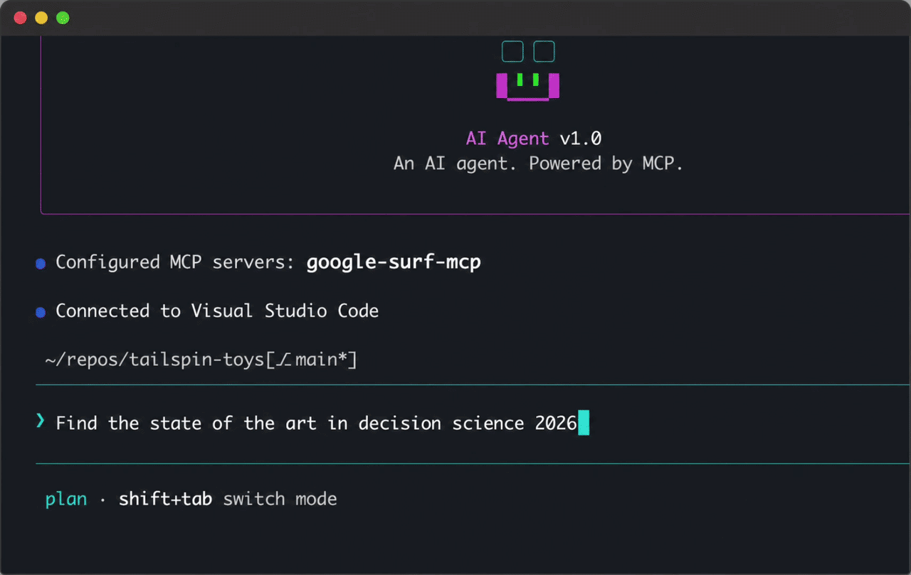

# google-surf-mcp

✨Anti-Bot Search MCP: No API Key✨

[English](./README.md) | 한국어



> 데모 영상은 시각화용이고, 실제 사용은 기본 **headless**로 동작합니다 (Chrome 창 안 보임). 영상처럼 보이게 하려면 `SURF_HEADLESS=false` 설정.

Google 검색 MCP. API 키 없음. 그냥 작동.

## What

어떤 MCP 클라이언트든 꽂으면 Google 검색을 도구로 쓸 수 있습니다.

CAPTCHA 솔버는 없습니다. 어느 도구에서든 CAPTCHA가 뜨면 보이는 Chrome 창이 자동으로 열려서 사람이 한 번 풀게 합니다. 각 풀이가 프로필의 Google 평판을 유지시킵니다. 지속가능하고 윤리적인 사용을 위한 설계.

설치 시 1회 ~1초 프로필 워밍업 필요 (Install 참고).

로컬 사용 전제. stateless / serverless 환경엔 부적합. warm 프로필이 핵심이라.

## Numbers

| | 결과 |
|---|---|
| sequential | ~2s/query (첫 호출은 ~4s, 셋업 포함) |
| parallel x4 | ~2s wall |
| parallel x10 | ~5s wall |
| search_extract x5 | ~7s wall (검색 + 5개 병렬 추출) |

워크스테이션 1Gbps 환경 측정. 하드웨어/네트워크에 따라 다름.

## Stack

- Playwright + 영구 Chrome 프로필
- `playwright-extra` stealth
- 이미지 / 미디어 / 폰트 차단 (속도용)
- 첫 실행 전 1회 프로필 부트스트랩
- Mozilla Readability + Turndown으로 본문 추출

## Install

Node 18+, 시스템에 Google Chrome (또는 Chromium) 필요.

```bash
npx google-surf-mcp   # 실제 MCP, 클라이언트 config에 등록
```

또는 로컬 클론:

```bash
git clone https://github.com/HarimxChoi/google-surf-mcp
cd google-surf-mcp
npm install
npm run bootstrap
```

`bootstrap`은 Chrome 창을 띄웁니다. 그 안에서 Google 검색 한 번 돌리고 닫으면 프로필 워밍 완료.

경로 오버라이드:
```bash
CHROME_PATH=/path/to/chrome SURF_TZ=America/New_York npm run bootstrap
```

## Claude Code에서 사용

`~/.claude.json`에 이거 붙여넣기:

```json
{
  "mcpServers": {
    "google-surf": {
      "command": "npx",
      "args": ["-y", "google-surf-mcp"]
    }
  }
}
```

Claude Code 재시작. 끝. `search`, `search_parallel`, `extract`, `search_extract` 도구가 바로 사용 가능합니다.

다른 MCP 클라이언트도 같은 JSON 구조 그대로 (config 파일 경로만 다름).

로컬 클론 사용 시:
```json
{
  "mcpServers": {
    "google-surf": {
      "command": "node",
      "args": ["/abs/path/to/google-surf-mcp/build/index.js"]
    }
  }
}
```

## Tools

- `search(query, limit?)` - 단일 검색, ~2초. title / url / snippet 반환.
- `search_parallel(queries[], limit?)` - 4-워커 풀. 호출당 최대 10개 쿼리.
- `extract(url, max_chars?)` - URL 가져와서 본문 마크다운 반환 (Readability + 텍스트 fallback). 실패는 `{ error }` 반환, throw 안 함.
- `search_extract(query, limit?, max_chars?)` - 검색 + 병렬 추출 한 번에. SERP 결과에 본문 마크다운 붙여서 반환. 페이지별 실패 격리.

`extract` + `search_extract`는 "검색하고 읽기" 워크플로우를 한 호출로 끝냄. 클라이언트가 snippet이 아니라 실제 본문을 받습니다.

## Env vars

| 변수 | 기본값 | 설명 |
|---|---|---|
| `CHROME_PATH` | 자동 감지 | Chrome 바이너리 절대 경로 |
| `SURF_PROFILE_ROOT` | `~/.google-surf-mcp` | warm 프로필 위치 |
| `SURF_LOCALE` | `en-US` | 브라우저 로케일 |
| `SURF_TZ` | 시스템 tz | 예: `America/New_York` |
| `SURF_HEADLESS` | `true` | `false`로 설정 시 Chrome 보이게 동작 (데모 / 디버깅용). CAPTCHA 자동 복구는 항상 보이게 동작. |
| `SURF_IDLE_CLOSE_MS` | `30000` | sequential ctx와 pool을 idle 후 닫는 ms. 낮으면 빠른 정리, 높으면 띄엄띄엄 호출에 캐시 유지. |

## Troubleshooting

- CAPTCHA: 4개 도구 어느 곳에서든 자동으로 Chrome 창이 열림. 한 번 풀고 그 안에서 검색 한 번 돌리면 호출이 자동 재시도되며 이어집니다. fail-fast로 가려면 디스플레이 없는 환경에서 실행.
- "Chrome not found": Chrome 설치 또는 `CHROME_PATH` 설정.
- 셀렉터 깨짐: Google이 클래스명 바꿈. PR 환영.

## License

MIT
