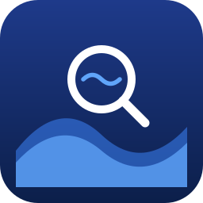

# google-surf-mcp

✨Anti-Bot Search MCP: No API Key✨

English | [한국어](./README.ko.md)

[](https://www.npmjs.com/package/google-surf-mcp)
[](https://www.npmjs.com/package/google-surf-mcp)
[](https://smithery.ai/servers/2-harim-choi/google-surf-mcp)
[](https://glama.ai/mcp/servers/HarimxChoi/google-surf-mcp)


> 실제 사용은 기본 **headless**로 동작합니다 (Chrome 창 안 보임). 영상처럼 보이게 하려면 `SURF_HEADLESS=false` 설정

무료 Google 검색 MCP가 전부 안 돼서 직접 만든 MCP

✅ 실제로 작동 (무료 MCP 6개 테스트, 전부 fail)  
✅ 1개 MCP로 검색 + 본문 추출 (기존: search MCP + fetch/URL MCP 2개 조합)  
✅ 5개 도구: `search` / `search_parallel` / `extract` / `search_extract` / `health`  
✅ API 키 / 프록시 / 솔버 X   
✅ CAPTCHA 자동 복구 (Chrome 창 떠서 사람이 풀면 자동 재시도)  
✅ `extract` SSRF 차단 (`localhost`, 사설 IP, AWS metadata 기본 차단)  

## How

MCP 클라이언트에 설정시 Google 검색 도구로 사용 가능, anti-bot은 warm Chrome profile + stealth로 처리  
CAPTCHA는 사람이 직접 함 (프로필 평판 유지 → 지속가능한 운영)

첫 설치 시 ~1초 프로필 워밍업 필요. 로컬 전용 — headless / 서버리스 환경은 `SURF_CLOUD_MODE=true` (CAPTCHA fail-fast, 워커 풀 비활성)

## Numbers

| | 결과 |
|---|---|
| sequential | ~1.5s/query (첫 호출은 ~4s, 셋업 포함) |
| parallel x4 | ~1.5s wall (첫 호출은 ~9s, pool warm 포함) |
| parallel x10 | ~4.5s wall |
| search_extract x5 | ~5s wall (검색 + 5개 병렬 추출) |

워크스테이션 1Gbps 환경에서 측정

## Stack

- Playwright + 영구 Chrome 프로필
- `playwright-extra` stealth (cascade fallback tier)
- 이미지 / 미디어 / 폰트 차단 (속도)
- 첫 실행 전 1회 프로필 부트스트랩
- Mozilla Readability + Turndown으로 본문 추출

## Install

Node 18+, 시스템에 Google Chrome (또는 Chromium) 필요

```bash
npx google-surf-mcp   # 실제 MCP, 클라이언트 config에 등록
```

또는 로컬 클론:

```bash
git clone https://github.com/HarimxChoi/google-surf-mcp
cd google-surf-mcp
npm install
npm run bootstrap
```

`bootstrap`은 Chrome 창을 띄웁니다. Google 검색 한번 해준 후, 닫으면 프로필 워밍 완료

경로 오버라이드:
```bash
CHROME_PATH=/path/to/chrome SURF_TZ=America/New_York npm run bootstrap
```

## Claude Code에서 사용

`~/.claude.json`에 이거 붙여넣기:

```json
{
  "mcpServers": {
    "google-surf": {
      "command": "npx",
      "args": ["-y", "google-surf-mcp"]
    }
  }
}
```

Claude Code 재시작

다른 MCP 클라이언트도 같은 JSON 구조 그대로 (config 파일 경로만 다름)

로컬 클론 사용 시:
```json
{
  "mcpServers": {
    "google-surf": {
      "command": "node",
      "args": ["/abs/path/to/google-surf-mcp/build/index.js"]
    }
  }
}
```

## Tools

- `search(query, limit?)` - 단일 검색, ~1.5초. title / url / snippet 반환. 스폰서 광고 자동 제외. 결과 24h 캐시 (`SURF_CACHE_TTL_SEARCH_MS=0`으로 우회)
- `search_parallel(queries[], limit?)` - 4-워커 풀. 호출당 최대 10개 쿼리
- `extract(url, max_chars?)` - URL 가져와서 본문 마크다운 반환 (Readability + 텍스트 fallback). 실패는 `{ error }` 반환, throw 안 함
- `search_extract(query, limit?, max_chars?)` - 검색 + 병렬 추출 한 번에. SERP 결과에 본문 마크다운 붙여서 반환. 페이지별 실패 격리
- `health()` - 서버 상태: cascade 모드, rate-limiter 사용량, 캐시 크기, 설정. 검색이 실패하기 시작하면 호출

`extract` + `search_extract`는 "검색하고 읽기" 워크플로우를 한 호출로 클라이언트가 snippet이 아닌 실제 본문을 받습니다

## Env vars

| 변수 | 기본값 | 설명 |
|---|---|---|
| `CHROME_PATH` | 자동 감지 | Chrome 바이너리 절대 경로 |
| `SURF_PROFILE_ROOT` | `~/.google-surf-mcp` | warm 프로필 위치 |
| `SURF_LOCALE` | `en-US` | 브라우저 로케일 |
| `SURF_TZ` | 시스템 tz | 예: `America/New_York` |
| `SURF_HEADLESS` | `true` | `false`로 설정 시 Chrome 보이게 동작 (데모 / 디버깅용). CAPTCHA 자동 복구는 항상 보이게 동작. |
| `SURF_IDLE_CLOSE_MS` | `30000` | sequential ctx와 pool을 idle 후 닫는 ms. `0`이면 비활성화. 낮으면 빠른 정리, 높으면 띄엄띄엄 호출에 캐시 유지. |
| `SURF_ALLOW_PRIVATE` | `false` | `true`로 설정 시 `extract`가 사설/loopback 주소(`localhost`, `127.0.0.1`, `10.x`, `192.168.x`, `169.254.x` 등) 접근 허용. 기본은 SSRF 차단으로 막음. |
| `SURF_CLOUD_MODE` | `false` | headless/서버리스 모드: TLS 우회 + `--no-sandbox` + `--disable-dev-shm-usage` + 워커 풀 비활성 + CAPTCHA fail-fast |
| `SURF_CASCADE_DISABLED` | `false` | 3-tier cascade 대신 단일 stealth 모드로 고정 |
| `SURF_USE_STEALTH` | `true` | 초기 stealth tier — `SURF_CASCADE_DISABLED=true`일 때만 적용 |
| `SURF_HUMANLIKE_MODE` | `off` | `off` / `background` / `inline` — opt-in humanlike 브라우징 동작 |
| `SURF_RATE_LIMIT_PER_MIN` | `10` | 분당 Google 요청 내부 상한 |
| `SURF_CACHE_TTL_SEARCH_MS` | `86400000` | search 캐시 TTL (24h); `0`이면 캐시 비활성화 |
| `SURF_CACHE_MAX_ENTRIES` | `1000` | 캐시 namespace별 LRU 상한 |
| `SURF_CACHE_ROOT` | `<profile>/cache` | 캐시 디렉토리 |
| `SURF_INSECURE_TLS` | `=SURF_CLOUD_MODE` | `--ignore-certificate-errors` (cloud 모드에서 자동 on) |
| `SURF_NO_SANDBOX` | `=SURF_CLOUD_MODE` | `--no-sandbox` (cloud 모드에서 자동 on) |

## Troubleshooting

- CAPTCHA: 모든 도구에서 자동으로 Chrome 창이 열림. 한 번 풀고 그 안에서 검색 한 번한 후 호출이 자동 재시도되며 이어집니다. 사람이 없는 환경이면 `SURF_CLOUD_MODE=true`로 fail-fast
- "Chrome not found": Chrome 설치 또는 `CHROME_PATH` 설정
- 셀렉터 깨짐: Google이 클래스명 바꿈. PR 환영합니다

## Changelog

[CHANGELOG.md](./CHANGELOG.md)

## License

MIT
