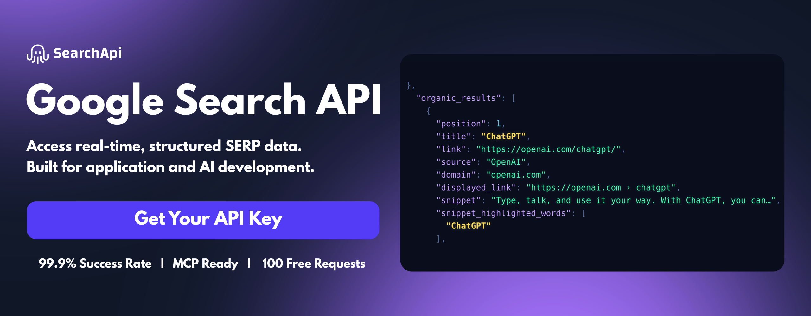
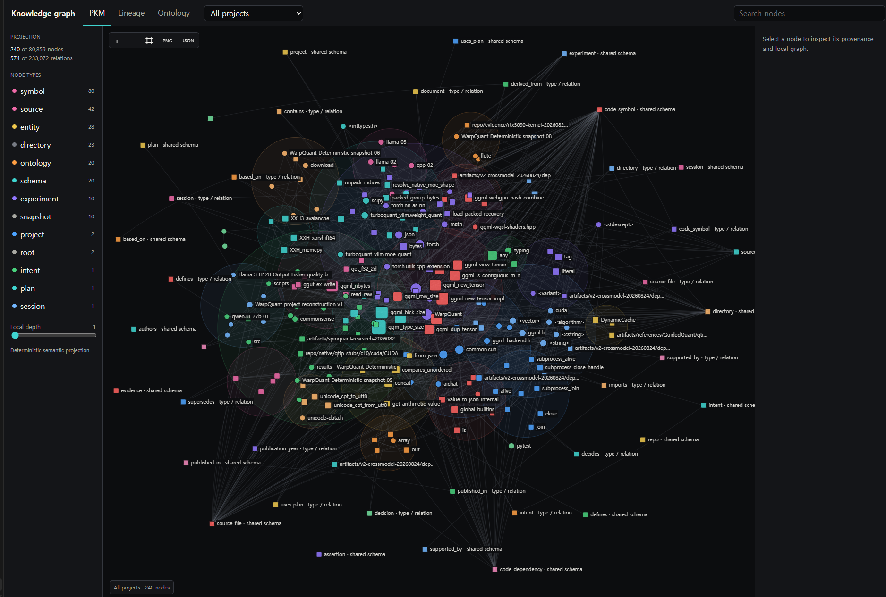
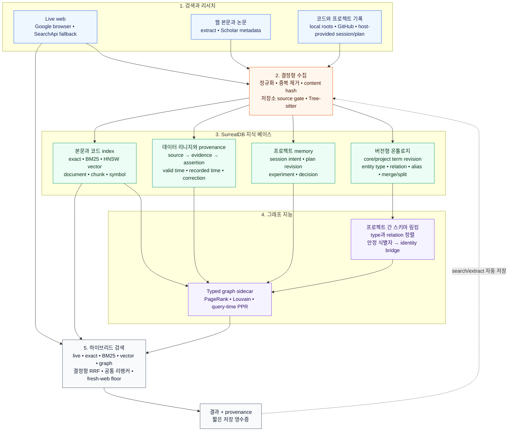
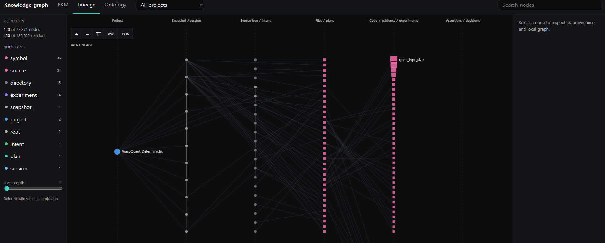
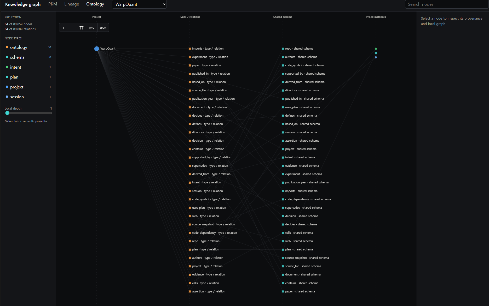

# google-surf-mcp

[English](./README.md) | 한국어

[](https://www.npmjs.com/package/google-surf-mcp)
[](https://www.npmjs.com/package/google-surf-mcp)
[](https://github.com/HarimxChoi/google-surf-mcp/actions/workflows/ci.yml)
[](https://glama.ai/mcp/servers/HarimxChoi/google-surf-mcp)

<p align="center">
  <a href="https://www.searchapi.io/?utm_source=github&utm_medium=sponsorship&utm_campaign=google_search_api&utm_content=HarimxChoi_google-surf-mcp"></a>
</p>
<p align="center"><a href="https://www.searchapi.io/?utm_source=github&utm_medium=sponsorship&utm_campaign=google_search_api&utm_content=HarimxChoi_google-surf-mcp">SearchApi</a> 후원</p>

<a href="./assets/graph-pkm.png"></a>

> 웹 검색, 논문과 GitHub 저장소에서 수집한 결과를 PKM, 온톨로지와 리니지로 저장합니다. 위 화면은 `project_memory(action="export", export_format="html", export_view="graph", all_projects=true)`로 생성합니다.

*"Turn Google Search, Papers, and Codebases into an Automatic Local Knowledge Graph and lineage for AI Agents with Zero API Key, Zero External Server."*

Google Surf는 검색(논문, 코드베이스, 웹검색결과, 프로젝트 계획 등) 및 추출 결과를 프로젝트별 로컬 지식 그래프에 저장합니다.

검색할수록 논문, 코드, 웹 자료, 세션 의도, 계획, 실험과 결정이 개인 PKM으로 축적됩니다. 새 리서치에서는 저장된 지식과 신규 웹 결과를 함께 검색해 중복 조사를 줄이고 새로운 정보를 찾습니다.

프로젝트는 기본적으로 분리됩니다. DOI, 저장소 주소와 명시적 alias처럼 검증 가능한 연결만 추가하므로 한 프로젝트에서 얻은 지식을 다른 프로젝트에서도 재사용할 수 있습니다.

검색 시에는 저장된 지식 그래프와 신규 웹 결과를 함께 조회합니다. Exact search, BM25, vector search, 코드 및 그래프 검색과 live web을 독립 실행하고 RRF와 공통 리랭커로 결합합니다.

```text
Live web + Papers + Codebases + Project memory
                        ↓
Exact + BM25 + Vector + Code graph + Graph PPR
                        ↓
              RRF + Shared reranker
                        ↓
        Results with evidence and provenance
```
기본 도구 7개: `search` / `search_parallel` / `extract` / `scholar_search` / `project_memory_search` / `project_memory` / `health`

Research 모드와 자동 저장은 기본으로 활성화됩니다. 검색과 추출만 사용하려면 `SURF_RESEARCH=false`로 설정합니다. 이때 DB와 graph sidecar를 열지 않고 프로젝트 메모리 도구도 등록하지 않습니다.

Research 모드를 꺼도 live `search`와 `search_parallel` 결과에는 경량 인메모리 리랭커가 적용됩니다. Provider 원본 순위와 쿼리 BM25 순위를 RRF로 결합하며 vector 모델이나 로컬 저장소는 열지 않습니다.

기본 브라우저 검색은 API 키가 필요 없습니다. SearchApi는 선택적으로 기본 provider 또는 fallback으로 사용할 수 있습니다.

## 핵심 기능

- **웹, 논문, 코드베이스 통합 검색:** Google 웹 검색을 기본으로 사용하고, 논문 metadata가 필요할 때는 Scholar를 사용합니다. SearchApi는 선택적 기본 provider 또는 fallback으로 동작합니다.
- **웹페이지와 학술 문서 추출:** HTML과 PDF에서 제목, 저자, DOI, 출판 정보와 본문을 읽습니다. `search`와 `search_parallel`에서도 abstract 또는 full 본문을 함께 가져올 수 있습니다.
- **자동 프로젝트 메모리:** 검색 결과, 읽은 본문과 코드 저장소를 현재 프로젝트에 자동 저장합니다. 아직 읽지 않은 결과는 metadata로 보존하고, 읽은 자료는 RAG 검색에 사용합니다.
- **코드베이스 구조 검색:** 로컬 프로젝트와 관련 GitHub 저장소를 Tree-sitter로 분석해 파일, symbol, import와 call relation을 연결합니다. Exact, BM25, vector와 graph 검색을 함께 사용합니다.
- **그래프 하이브리드 검색:** 신규 웹 결과, 논문, 저장된 본문, 코드베이스와 프로젝트 그래프를 독립적으로 검색합니다. Exact, BM25, vector와 PPR 결과를 RRF와 공통 리랭커로 결합합니다.
- **온톨로지와 데이터 리니지:** 웹 자료, 논문, 코드, 계획, 실험과 결정을 typed entity와 relation으로 구조화합니다. 출처에서 document, chunk, symbol, evidence와 assertion까지 근거 경로를 추적합니다.
- **프로젝트 간 지식 재사용:** 프로젝트는 기본적으로 분리하지만, 선택한 프로젝트를 함께 검색할 수 있습니다. 검증 가능한 연결만 같은 entity로 연결합니다.
- **연구 과정의 지속적인 기록:** MCP host가 전달한 세션 의도, 계획, 실험, 실패와 결정을 revision 형태로 저장합니다. 어떤 자료와 실험이 다음 계획이나 결정의 근거가 됐는지 연결합니다.
- **로컬 그래프 분석과 내보내기:** 별도 Neo4j 서버 없이 PageRank, PPR, connected components와 Louvain community를 계산합니다. 결과는 HTML, Graphviz, D3 JSON과 Neo4j import 형식으로 내보낼 수 있습니다.

## 검색

- API 키가 필요 없는 시스템 Chrome 검색
- 사용자 Chrome profile을 읽거나 복사하지 않는 전용 비로그인 profile
- Multi-strategy SERP parsing과 geometric 검증
- 광고와 지식 패널 제거
- CAPTCHA 감지와 환경별 복구
- Parser self-healing과 context fallback

### Live 리랭커 검증

| 홀드아웃 32개 | nDCG@5 | MRR | Precision@5 |
|---|---:|---:|---:|
| 기존 Provider 순위 | 0.8949 | 0.8203 | 0.6375 |
| BM25 + RRF | **0.8971** | **0.8203** | **0.6500** |

## Supported AI providers and gateways

- [OrcaRouter](https://www.orcarouter.ai/ref/ref_7fd137d6c7b30793af2f) (free models available)

## Numbers

| | 결과 |
|---|---|
| search | 4.0-5.1초/query |
| scholar_search | 3.8-5.6초/query |

워크스테이션 1Gbps 환경에서 provider별 캐시 없는 쿼리 3건으로 측정했습니다. 네트워크와 Google 응답 시간에 따라 달라집니다.

## Tech Stack

- **Runtime:** Node.js, TypeScript, Model Context Protocol SDK
- **Web search:** System Chrome + CDP, Playwright compatibility fallback, SearchApi fallback
- **Web extraction:** Mozilla Readability, Turndown
- **PDF extraction:** LiteParse/PDFium, optional OCR, `pdf-lib` metadata parsing
- **Code collection:** Local project roots and gated GitHub sparse download
- **Code parsing:** Tree-sitter for files, symbols, imports and call relations
- **Code search:** Exact lookup, BM25, Multilingual E5 vector search and graph PPR
- **Local database:** Embedded SurrealDB on RocksDB
- **Hybrid retrieval:** Live web, papers, project memory and codebase results combined through RRF
- **Ranking:** Reciprocal Rank Fusion and shared vector reranking
- **Graph analysis:** Graphology, PageRank, PPR, connected components and Louvain communities
- **Knowledge model:** Versioned ontology, data lineage, cross-project schema and entity linking
- **Recovery:** CAPTCHA recovery, Playwright pool fallback and deterministic parser self-healing

## Install

Node 20.18.1+ 필요. 브라우저 모드는 Google Chrome 또는 Chromium도 필요합니다.

```bash
npx google-surf-mcp   # 실제 MCP, 클라이언트 config에 등록
```

첫 호출 시 프로필 자동 워밍 (Chrome 창이 잠깐 보일 수 있음)

또는 로컬 클론:

```bash
git clone https://github.com/HarimxChoi/google-surf-mcp
cd google-surf-mcp
npm install
```

자동 부트스트랩 실패 시 (드묾) 수동 실행:
```bash
npm run bootstrap
```

경로 오버라이드:
```bash
CHROME_PATH=/path/to/chrome SURF_TZ=America/New_York npm run bootstrap
```

## Claude Code에서 사용

`~/.claude.json`에 이거 붙여넣기:

```json
{
  "mcpServers": {
    "google-surf": {
      "command": "npx",
      "args": ["-y", "google-surf-mcp"]
    }
  }
}
```

Claude Code를 재시작하면 기본 도구 7개를 사용할 수 있습니다. `SURF_RESEARCH=false`이면 `project_memory_search`와 `project_memory`가 제외됩니다.

다른 MCP 클라이언트도 같은 JSON 구조 그대로 (config 파일 경로만 다름)

## 검색 provider

기본값은 기존 브라우저 검색입니다. [SearchApi](https://www.searchapi.io/?utm_source=github&utm_medium=sponsorship&utm_campaign=google_search_api&utm_content=HarimxChoi_google-surf-mcp)를 메인 provider 또는 브라우저 실패 시 fallback으로 설정할 수 있습니다.

| 값 | 동작 |
|---|---|
| `browser` | 기본값. 전용 비로그인 프로필의 시스템 Chrome 검색 창을 숨긴 상태로 유지하며 `SEARCH_API`가 필요하지 않습니다. 여러 MCP 세션이 로컬 browser broker 하나를 공유합니다. |
| `searchapi` | SearchApi를 메인 provider로 사용합니다. 해당 도구 실행 시 Chrome을 초기화하지 않습니다. |
| `fallback` | 현재 브라우저 tier를 한 번 시도한 뒤 브라우저 오류, CAPTCHA나 rate limit, 프로필 실패, 파서 열화 시 SearchApi로 전환합니다. 사람의 CAPTCHA 해결을 기다리지 않으며 성공 응답과 정상적인 빈 결과는 다시 요청하지 않습니다. |

`SURF_SEARCH_PROVIDER`는 `search`, `search_parallel`에 적용됩니다. `SURF_SCHOLAR_PROVIDER`는 `scholar_search`에 적용됩니다. SearchApi 모드는 본인의 SearchApi 계정, API 키, 사용 가능한 크레딧이 필요합니다.

`SURF_BROWSER_ENGINE=auto`는 로컬 데스크톱에서 native Chrome을, cloud 또는 remote-debug 환경에서 Playwright 호환 경로를 선택합니다. Native 모드는 headless Chrome이 아니라 숨겨진 일반 Chrome을 사용합니다. `native`나 `playwright`로 고정할 수 있습니다.

## Tools

- `search(query, limit?, extract_mode?, extract_limit?, response_content?, max_chars?)` - 단일 쿼리의 라이브 탐색과 읽기를 함께 수행하는 기본 도구입니다. 신규 자료를 찾고 읽어야 하면 PDF 다운로드, 저장소 clone, 별도 `extract` 호출 대신 이 호출에 `extract_mode`를 지정합니다. `extract`는 정확한 공개 URL을 이미 알고 있고 신규 탐색이 필요 없을 때만 사용합니다. `project_id`가 있으면 저장된 지식을 라이브 결과와 결합하지만 로컬 전용 검색으로 바뀌지는 않습니다. `limit`은 1-20입니다. 추출 기본값은 `none`, `extract_limit`은 1-10이며 기본값은 5입니다. 한 번의 응답 크기를 제한하기 위해 `response_content`는 `summary`가 기본값입니다.
- `scholar_search(query, limit?)` - Google Scholar metadata 검색. `limit`은 1-10입니다. 브라우저, SearchApi 메인, fallback을 지원합니다.
- `search_parallel(queries[], limit?, extract_mode?, extract_limit?, response_content?, max_chars?)` - 여러 쿼리의 넓은 라이브 탐색과 읽기를 함께 수행하는 기본 도구입니다. 최대 4개 탭이 2-12개 쿼리를 처리하며, 웹페이지, PDF, 논문, GitHub 저장소를 읽어야 하면 같은 호출에 `extract_mode`를 지정합니다. 로컬 PDF 도구는 로컬 파일이나 시각적 레이아웃 검토에만 사용하고, 저장소 clone은 편집, 빌드, 테스트, 전체 Git 이력이 필요할 때만 사용합니다. 쿼리별 `limit`은 1-20입니다. 호출 전체의 `extract_limit`은 abstract에서 기본 12, 최대 20이며 full에서 기본값과 최대값이 10입니다. `response_content`는 한 번의 응답 크기를 제한하기 위해 `summary`가 기본값입니다.
- 통합 추출 결과는 `requested`, `applied`, `skipped`, `truncated`, `total_chars`를 반환합니다. `remaining_urls`는 검색을 반복하지 않고 `extract`에 바로 전달할 수 있습니다.
- `extract(url, max_chars?, mode?, response_content?)` - 신규 탐색 없이 정확한 공개 URL 하나를 읽는 차선 도구입니다. 출처를 찾아야 한다면 `search` 또는 `search_parallel`에 `extract_mode`를 지정합니다.
  - `mode="full"` (기본): research 저장용으로 최대 1000000자를 읽고 4000자 단위의 deterministic chunk로 저장합니다. `response_content="full"`은 최대 50000자, `summary`는 1500자 근거 발췌를 반환합니다.
  - `mode="abstract"`: ~1500자 요약 (PDF 1페이지 또는 HTML meta description). research 모드에서는 문서 메타데이터도 요약과 함께 저장
  - `mode="metadata"`: 본문 없이 메타데이터만 반환. 가능한 경우 제목, 저자, 게재 정보, 날짜, DOI, 설명, 키워드, canonical URL과 PDF 페이지 수 및 문서 속성을 포함
  - GitHub 저장소 URL은 metadata에서 README를 읽고, abstract와 full은 같은 다운로드 기준을 적용하되 색인할 소스 범위만 다름
  - 응답: 본문 필드와 확인 가능한 문서 메타데이터. 실패는 `{ error }` 반환, throw 안 함
- `project_memory_search(query, query_variants?, project_id?, include_project_ids?, all_projects?, limit?)` - 저장된 로컬 지식만 검색합니다. optional variant를 최대 19개까지 한 broker 요청에서 처리하며 query embedding batch, RRF 통합, 검색 근거 기반 graph 확장, 핵심 `query` 기준 최종 rerank를 한 번 수행합니다. 응답에는 최종 순위의 query-focused 요약만 제한된 길이로 포함하고 원문은 DB에 남깁니다. 정확한 식별자와 따옴표 표현은 deterministic variant로 자동 추가합니다. 반복 terminal 호출 대신 이 도구를 한 번 사용하며 브라우저, Google, SearchApi는 호출하지 않습니다.
- `project_memory(action, ...)` - `SURF_RESEARCH=true`일 때 프로젝트 지식을 관리합니다.
  - `action="search"`: `project_memory_search`를 위한 호환 alias입니다.
  - `action="show"`: 항상 count와 활성 record ID만 포함한 제한된 요약을 반환합니다. `detail_level="full"`은 호환성을 위해 허용하지만 전체 record 본문을 덤프하지 않습니다. 관련 본문은 `project_memory_search`, 단일 assertion이나 entity는 `target_id`를 사용합니다.
  - `action="record"`: 전달한 본문을 저장하고 ID, revision, status만 반환합니다.
  - `action="export"`: 독립 실행형 HTML 탐색기, Graphviz DOT, D3 node-link JSON 또는 Neo4j import 묶음을 `<research-root>/exports`에 저장합니다.
- `health()` - 검색과 로컬 research runtime 상태

| 목적 | 도구 |
|---|---|
| 이전에 저장한 리서치와 프로젝트 메모리만 검색 | `project_memory_search` |
| 웹에서 신규 정보 검색 | `search` |
| 신규 웹 결과와 저장된 프로젝트 지식을 함께 비교 | `project_id`를 지정한 `search` |
| 여러 신규 웹 쿼리 실행 | `search_parallel` |

## 재실행 가능한 리서치 수집

`google-surf-collect`는 버전형 JSON 명세를 하나의 지속 MCP 세션에서 실행합니다. 하나의 명세에 라이브 `search`와 로컬 전용 `project_memory_search` 작업을 함께 넣을 수 있습니다. 라이브 작업은 같은 호출에서 본문을 추출하고, 로컬 작업은 Google을 열지 않고 이미 색인된 프로젝트 지식을 검색합니다.

```bash
npx google-surf-collect examples/research-collection.example.json
```

소스 체크아웃에서는 다음과 같이 실행합니다.

```bash
npm run build
npm run research:collect -- examples/research-collection.example.json
```

프로젝트 워크플로에서는 지속 세션과 계획을 기록하고, 승인된 코드 root를 색인하고, 생성된 로컬 지식을 검색한 뒤 그래프를 export할 수 있습니다.

```bash
npm run research:collect -- examples/project-memory-workflow.example.json
```

`project_memory` 수집 작업은 `record`, `rebuild`, `export`만 허용합니다. 삭제 작업인 `forget`은 수집 명세에서 허용하지 않습니다. 전체 프로젝트 export가 아니면 상위 `project_id`를 모든 작업이 상속합니다.

출력은 append-only JSONL입니다. manifest에는 정규화된 명세 hash, 패키지 버전, Git commit, Node 런타임, 플랫폼, 프로젝트 준비 상태와 서버 상태가 기록됩니다. 검색, 기록, 색인과 export 결과에는 안정적인 job id, 정확한 도구 인자, attempt, 시작·종료 시각, 소요시간, 응답과 오류 상태가 남습니다. 재실행하면 성공한 작업은 건너뛰고 실패한 작업만 다시 시도합니다. 명세가 바뀌면 새 출력 파일을 사용해야 합니다. 없는 프로젝트를 실행기가 생성해야 하면 `project_id`와 함께 `project_name`을 지정합니다. 기존 프로젝트는 그대로 재사용합니다.

기존 프로젝트 RAG 상태가 라이브 결과 순위에 영향을 주지 않아야 하면 `retrieval_mode`를 `live`로 설정합니다. 검색 결과는 그대로 `project_id`에 저장됩니다. 신규 웹 근거와 저장 지식을 의도적으로 함께 평가할 때는 `hybrid`를 사용합니다. API 키와 환경변수 값은 수집 로그에 기록하지 않습니다.

이 방식은 수집 절차와 반환된 snapshot을 재실행하고 감사할 수 있게 합니다. 라이브 웹 결과 자체는 시각, 로케일, 네트워크 경로와 upstream ranking에 따라 달라질 수 있습니다.

## 온톨로지와 데이터 리니지가 적용된 그래프 하이브리드 RAG 구조


```mermaid
flowchart TB
    subgraph SOURCES["1. 검색과 리서치"]
        direction LR
        LIVE["Live web<br/>Google browser • SearchApi fallback"]
        PAPER["웹 본문과 논문<br/>extract • Scholar metadata"]
        PROJECT_INPUT["코드와 프로젝트 기록<br/>local roots • GitHub • host-provided session/plan"]
    end

    INGEST["2. 결정형 수집<br/>정규화 • 중복 제거 • content hash<br/>저장소 source gate • Tree-sitter"]

    subgraph KNOWLEDGE_BASE["3. SurrealDB 지식 베이스"]
        direction LR
        CONTENT["본문과 코드 index<br/>exact • BM25 • HNSW vector<br/>document • chunk • symbol"]
        PROV["데이터 리니지와 provenance<br/>source → evidence → assertion<br/>valid time • recorded time • correction"]
        ONTOLOGY["버전형 온톨로지<br/>core/project term revision<br/>entity type • relation • alias • merge/split"]
        MEMORY["프로젝트 memory<br/>session intent • plan revision<br/>experiment • decision"]
    end

    subgraph INTELLIGENCE["4. 그래프 지능"]
        direction LR
        SCHEMA["프로젝트 간 스키마 링킹<br/>type과 relation 정렬<br/>안정 식별자 → identity bridge"]
        SIDECAR["Typed graph sidecar<br/>PageRank • Louvain • query-time PPR"]
    end

    FUSION["5. 하이브리드 검색<br/>live • exact • BM25 • vector • graph<br/>결정형 RRF • 공통 리랭커 • fresh-web floor"]
    RESULTS["결과 + provenance<br/>짧은 저장 영수증"]

    LIVE --> INGEST
    PAPER --> INGEST
    PROJECT_INPUT --> INGEST
    INGEST --> CONTENT
    INGEST --> PROV
    INGEST --> ONTOLOGY
    INGEST --> MEMORY
    ONTOLOGY --> SCHEMA
    CONTENT --> SIDECAR
    PROV --> SIDECAR
    MEMORY --> SIDECAR
    SCHEMA --> SIDECAR
    LIVE --> FUSION
    CONTENT --> FUSION
    SIDECAR --> FUSION
    FUSION --> RESULTS
    RESULTS -. "search/extract 자동 저장" .-> INGEST

    classDef inputStyle fill:#eef6ff,stroke:#2563eb,color:#172554
    classDef processStyle fill:#fff7ed,stroke:#ea580c,color:#431407
    classDef storageStyle fill:#ecfdf5,stroke:#059669,color:#052e16
    classDef intelligenceStyle fill:#f5f3ff,stroke:#7c3aed,color:#2e1065
    classDef outputStyle fill:#f8fafc,stroke:#475569,color:#0f172a
    class LIVE,PAPER,PROJECT_INPUT inputStyle
    class INGEST processStyle
    class CONTENT,PROV,ONTOLOGY,MEMORY storageStyle
    class SCHEMA,SIDECAR intelligenceStyle
    class FUSION,RESULTS outputStyle
```

### 하나의 로컬 지식 베이스

SurrealDB 하나가 웹 검색, 논문, 코드, 세션, 계획, 실험, 결정, 온톨로지와 provenance를 영구 저장합니다. 로컬 research broker 하나만 embedded RocksDB 연결을 소유합니다. 여러 MCP 세션은 인증된 로컬 IPC로 broker에 연결해 조회를 병렬 실행하고 쓰기 순서를 보장하며 DB를 직접 열지 않습니다. Graph projection과 PageRank, community 같은 분석 결과는 원본이 아니라 source hash와 ontology version에서 다시 만들 수 있는 파생 데이터로 관리합니다.

### 온톨로지와 프로젝트 간 연결

Versioned ontology는 entity type과 relation의 변경 이력을 revision으로 보존합니다. Schema linking은 프로젝트마다 다른 type과 relation을 공통 schema에 정렬하고, entity linking은 DOI, 저장소 주소와 명시적 alias처럼 검증 가능한 식별자가 일치할 때만 같은 대상을 연결합니다. 모호한 후보는 자동으로 연결하지 않습니다.

### 데이터와 연구 리니지

- **Source lineage:** `source → document → chunk → evidence → assertion`
- **Code lineage:** `repository → directory → file → symbol → import/call`
- **Research lineage:** `session → intent → plan revision → experiment → decision`

주장과 결정이 어떤 자료, 코드와 실험에서 나왔는지 추적할 수 있으며, 수정 전 기록도 함께 보존합니다.

### 그래프 검색

Graphology는 SurrealDB의 원본에서 typed graph projection을 만들고 PageRank, connected components와 Louvain community를 계산합니다. 검색할 때는 관련 node를 시작점으로 PPR 기반 multi-hop 검색을 수행합니다. Live web, exact, BM25, vector와 graph 결과는 결정형 RRF와 공통 리랭커로 결합합니다.

로컬 multi-query 검색은 query embedding을 batch 처리하고 lexical·vector 후보를 먼저 통합한 뒤 graph 확장, 선택 chunk hydrate, 최종 rerank를 각각 한 번만 수행합니다. Graph-only 전체 프로젝트 검색은 query 시점에 모든 프로젝트 graph를 만들지 않고 가벼운 memory-node index와 검증된 identity alias로 최대 4개 graph scope를 선택합니다.

### 프로젝트 격리와 지식 재사용

`project_id`는 새 검색 결과가 저장될 프로젝트를 지정합니다. `include_project_ids`는 저장 위치를 바꾸지 않고 함께 검색할 프로젝트만 추가합니다. 원본 record는 프로젝트별로 분리해 유지하고, 검증된 schema와 entity link를 통해 다른 프로젝트의 논문, 코드와 실험 결과를 재사용합니다.

### 인터랙티브 그래프와 내보내기

`project_memory(action="export", export_format="html", export_view="graph")`를 사용합니다. 반환된 단일 HTML 파일은 서버 없이 로컬에서 열리며 세 뷰를 함께 제공합니다. `project_id`는 단일 프로젝트, `include_project_ids`는 선택한 프로젝트 통합, `all_projects=true`는 전체 프로젝트를 포함합니다.

- **PKM**은 통합 프로젝트 그래프를 community별로 묶고 PageRank에 따라 node 크기를 조정합니다.
- **Lineage**는 source와 code 계보, session, intent, plan, experiment, decision 계보를 분리하고 같은 단계끼리 정렬합니다.
- **Ontology**는 core type과 relation, 정렬된 shared schema, typed instance를 표시합니다. 안정적 식별자나 명시적 alias가 프로젝트 간 일치를 증명할 때만 verified identity 계층을 표시합니다.

<table>
  <tr>
    <td width="50%" align="center">
      <a href="./assets/graph-lineage.png"></a><br />
      <strong>데이터 및 연구 리니지</strong>
    </td>
    <td width="50%" align="center">
      <a href="./assets/graph-ontology.png"></a><br />
      <strong>Ontology와 shared schema</strong>
    </td>
  </tr>
</table>

검색, type filter, 1~3 hop local focus, pan, zoom과 provenance inspector가 파일 안에서 동작합니다. 대형 그래프는 node type, PageRank, degree와 community coverage를 결합한 결정론적 semantic projection으로 축약합니다. 원본과 표시된 node/edge 수를 함께 보여주고 내부 ID를 로컬 alias로 바꾸며 중복 label을 구분합니다. Source ID, 로컬 경로, node 본문, 계획 본문과 evidence quote는 포함하지 않습니다.

Project menu에서 export에 포함된 개별 프로젝트와 통합 `All projects` view를 전환합니다. 로컬 DB의 모든 named project를 포함하려면 export 시 `all_projects=true`를 사용하고, 범위를 제한하려면 `project_id`와 `include_project_ids`를 사용합니다. 빈 canvas를 클릭하면 local node focus가 해제됩니다. PNG는 현재 canvas를 저장하고 JSON은 현재 tab, project, type filter, local focus가 적용된 익명화 viewer payload만 저장합니다. 단일 HTML은 nonce-bound script CSP를 사용하고 network connection을 만들지 않으며, query와 credential을 제거한 public HTTP 또는 HTTPS source link만 허용합니다.

#### Neo4j 내보내기

`project_memory(action="export", export_format="neo4j", export_view="graph")`를 사용합니다. 반환된 디렉터리에는 `nodes.csv`, `relationships.csv`, `constraints.cypher`, `load.cypher`, `manifest.json`, `README.txt`가 들어갑니다. PageRank, community, ontology, lineage, project ID, source ID와 evidence ID는 유지하고 node 본문, 계획 본문과 evidence quote는 내보내지 않습니다.

새 로컬 DB나 빈 DB에는 export 디렉터리에서 다음 명령을 실행합니다.

```powershell
neo4j-admin database import full --nodes=nodes.csv --relationships=relationships.csv neo4j
```

기존 로컬 DB에는 두 CSV 파일을 Neo4j import 디렉터리로 복사한 뒤 다음을 실행합니다.

```powershell
cypher-shell -f constraints.cypher
cypher-shell -f load.cypher
```

오프라인 importer는 node label과 relationship type을 그대로 만듭니다. 온라인 loader는 `SurfNode`와 `SURF_RELATION`을 사용하고 원래 kind와 relation type을 property로 보존합니다. `neo4j-admin database import full`은 새 DB나 빈 DB용이며 기존 DB에는 `LOAD CSV`를 사용합니다. 자세한 내용은 공식 [Neo4j import](https://neo4j.com/docs/operations-manual/current/import/)와 [LOAD CSV](https://neo4j.com/docs/cypher-manual/current/clauses/load-csv/) 문서를 참고합니다. Bolt는 파일 형식이 아닌 연결 프로토콜이므로 이 명령은 Neo4j 서버에 접속하거나 데이터를 수정하지 않습니다.

### 저장 범위와 보안

Research 모드는 기본으로 활성화됩니다. `search`, `search_parallel`, `scholar_search`와 `extract` 결과는 자동 저장하지만, 세션 의도, 계획, 실험과 결정은 MCP host가 `project_memory`로 전달한 경우에만 저장합니다. 이후 versioning, ontology mapping과 lineage 연결은 자동으로 처리합니다. 검색 분기는 호출 인자가 아니라 서버 config로 고정합니다.

이미지 검색, 이미지 임베딩과 시각 리랭킹은 포함하지 않습니다. OCR은 스캔 PDF에서 검색 가능한 텍스트를 복구할 때만 사용합니다.

Credential과 private-key 파일은 본문 색인에서 제외합니다. HTML export에는 source ID, 로컬 경로, node 본문, 계획 본문과 evidence quote를 포함하지 않습니다. Viewer는 스스로 network 요청을 만들지 않으며 사용자가 선택한 public HTTP 또는 HTTPS source link만 열 수 있습니다.

프로젝트와 assertion 삭제는 count 미리보기와 confirmation token을 요구합니다. 삭제 대상은 복원 가능한 tombstone으로 남고 evidence와 correction 이력도 보존됩니다. 사실 수정은 `target_id`, `replacement`, `reason`만 받으며 이전 assertion은 bitemporal 이력으로 유지합니다. 계획은 덮어쓰지 않고 revision으로 추가됩니다. 실험은 당시 active 계획에 연결되며 `success`, `failed`, `inconclusive` 중 하나로 명시적으로 종료해야 합니다. 로그만 보고 결과를 추론하지 않습니다. 영수증에는 저장된 항목만 짧게 표시합니다.

```text
프로젝트: Graph memory | 세션: temporal graph research | 저장: 논문 1 (Graphiti), 레포 1 (getzep), 검색 요약 3 | 상태: 준비
```

`SURF_RESEARCH=false`이면 DB와 sidecar를 열지 않고 `project_memory_search`와 `project_memory`도 등록하지 않습니다. Obsidian과 Notion 동기화는 포함하지 않으며 이후에도 프로젝트별 opt-in으로만 제공합니다.

## Env vars

| 변수 | 기본값 | 설명 |
|---|---|---|
| `SEARCH_API` | 미설정 | SearchApi API 키. provider가 `searchapi` 또는 `fallback`일 때만 필요합니다. bearer token으로 전송하며 URL에는 넣지 않습니다. |
| `SEARCHAPI_API_KEY` | 미설정 | `SEARCH_API` 별칭 |
| `SURF_SEARCH_PROVIDER` | `browser` | `search`, `search_parallel` provider: `browser`, `searchapi`, `fallback` |
| `SURF_SCHOLAR_PROVIDER` | `browser` | `scholar_search` provider: `browser`, `searchapi`, `fallback` |
| `SURF_BROWSER_ENGINE` | `auto` | 브라우저 엔진: `auto`, `native`, `playwright`. Native Chrome은 검색 요청 완료 후 읽기 전용 CDP를 연결합니다. |
| `CHROME_PATH` | 자동 감지 | Chrome 바이너리 절대 경로 |
| `SURF_PROFILE_ROOT` | `~/.google-surf-mcp` | warm 프로필 위치 |
| `SURF_RESEARCH` | `true` | 로컬 프로젝트 메모리, 저장, 색인, `project_memory_search`와 `project_memory` 활성화 |
| `SURF_RETRIEVAL_MODE` | `hybrid` | 연구 검색 분기: `live` 또는 `hybrid`. `SURF_RESEARCH=true`일 때만 사용 |
| `SURF_RESEARCH_ROOT` | `<profile>/research` | embedded SurrealDB 데이터 디렉터리 |
| `SURF_RESEARCH_VECTOR_MODEL` | `Xenova/multilingual-e5-small` | HNSW vector 검색과 최종 리랭킹에 쓰는 local 384차원 모델. 기본 model revision은 고정되며 `off`로 vector lane 비활성화 |
| `SURF_RESEARCH_VECTOR_LOW_MEMORY` | `true` | ONNX CPU memory arena와 memory pattern을 비활성화. `false`는 최초 색인 속도를 높이는 대신 peak memory 증가 |
| `SURF_RESEARCH_VECTOR_THREADS` | `4` | ONNX intra-op thread 수. 1-16 범위 |
| `SURF_RESEARCH_REPO_AUTO` | `true` | 검색 호출당 작고 관련성 높은 GitHub 저장소를 최대 하나 sparse-index |
| `SURF_RESEARCH_REPO_AUTO_MAX_MB` | `20` | 자동 GitHub 색인의 검색 가능한 소스 텍스트 상한. asset은 제외 |
| `SURF_RESEARCH_REPO_AUTO_MAX_FILES` | `2000` | 자동 GitHub 색인의 검색 가능한 소스 파일 수 상한 |
| `SURF_RESEARCH_BROKER_IDLE_MS` | `60000` | 마지막 client 연결이 끝난 뒤 shared research broker를 유지하는 시간 |
| `SURF_RESEARCH_READ_CONCURRENCY` | `4` | broker 동시 조회 상한. 동일한 진행 중 조회는 하나의 연산을 공유 |
| `SURF_RESEARCH_QUERY_TIMEOUT_MS` | `30000` | embedded SurrealDB query timeout. 1-600초 범위 |
| `GITHUB_TOKEN` | 미설정 | 저장소 확인을 위한 GitHub API 한도를 높이는 선택 token |
| `SURF_RESEARCH_CODE_WORKERS` | 자동, 최대 4 | 최초 코드 구조 색인에 사용하는 Tree-sitter worker 수 |
| `SURF_LOCALE` | `en-US` | 브라우저 로케일 |
| `SURF_TZ` | 시스템 tz | 예: `America/New_York` |
| `SURF_HEADLESS` | `true` | Playwright 추출, 호환성과 복구 경로에 적용. Native 검색은 일반 Chrome 창을 숨기고 CAPTCHA 복구 때만 표시 |
| `SURF_REMOTE_DEBUG` | `false` | headless 서버 + 원격 DevTools 환경에서 `true`. CAPTCHA 발생 시 DevTools 포트 안내 후 throw, 별도 창 안 띄움. 로컬 머신에서 SSH 포트포워드 + `chrome://inspect`로 풀고 재시도. |
| `SURF_CAPTCHA_TIMEOUT_MS` | `180000` | 백그라운드 CAPTCHA 해결 창 유지 시간. MCP 호출은 이 timeout을 기다리지 않고 즉시 반환 |
| `SURF_IDLE_CLOSE_MS` | `30000` | sequential ctx와 pool을 idle 후 닫는 ms. `0`이면 비활성화. 낮으면 빠른 정리, 높으면 띄엄띄엄 호출에 캐시 유지. |
| `SURF_ALLOW_PRIVATE` | `false` | `true`로 설정 시 `extract`가 사설/loopback 주소(`localhost`, `127.0.0.1`, `10.x`, `192.168.x`, `169.254.x` 등) 접근 허용. 기본은 SSRF 차단으로 막음. |
| `SURF_EXTRACT_MAX_CHARS` | `50000` | full 추출 한도 (200-50000). abstract 기본값은 1500이며 per-call `max_chars`가 우선 |
| `SURF_EXTRACT_OCR` | `false` | 스캔/이미지 PDF를 Tesseract로 OCR (느림; 기본 off) |
| `SURF_CLOUD_MODE` | `false` | headless/서버리스 모드: TLS 우회 + `--no-sandbox` + `--disable-dev-shm-usage` + 워커 풀 비활성 + CAPTCHA fail-fast |
| `SURF_CASCADE_DISABLED` | `false` | 3-tier 자동 cascade 대신 단일 stealth 모드(`SURF_USE_STEALTH`로 선택)로 고정 |
| `SURF_USE_STEALTH` | `true` | 초기 stealth tier. `SURF_CASCADE_DISABLED=true`일 때만 적용 |
| `SURF_HUMANLIKE_MODE` | `background` | `off` / `background` (결과 반환 후 비동기 실행) / `inline` (반환 전 대기, 더 느림) |
| `SURF_RATE_LIMIT_PER_MIN` | `10` | 분당 Google 요청 내부 상한 |
| `SURF_CACHE_TTL_SEARCH_MS` | `86400000` | search 캐시 TTL (24h); `0`이면 캐시 비활성화 |
| `SURF_CACHE_MAX_ENTRIES` | `1000` | 캐시 namespace별 LRU 상한 |
| `SURF_CACHE_ROOT` | `<profile>/cache` | 캐시 디렉토리 |
| `SURF_INSECURE_TLS` | `=SURF_CLOUD_MODE` | `--ignore-certificate-errors` (cloud 모드에서 자동 on) |
| `SURF_NO_SANDBOX` | `=SURF_CLOUD_MODE` | `--no-sandbox` (cloud 모드에서 자동 on) |
| `SURF_TELEMETRY` | `false` | `true`로 설정 시 jsonl 이벤트 로깅 활성화 (검색 결과, 캐시 hit/miss, tool 에러, parser staleness 기록). self-healing 파이프라인의 입력으로 사용. 기본 OFF. |
| `SURF_TELEMETRY_ROOT` | `<profile>/telemetry` | jsonl 파일 디렉토리. UTC 기준 날짜별 파일 1개 (`YYYY-MM-DD.jsonl`). |
| `SURF_SELF_HEALING` | `true` | strategy별 성공/실패 추적 + 영속 재배열. leader가 runner-up보다 3승 차이 이상일 때만 재배열 발동. `false`로 끄면 기본 strategy 순서 고정 |
| `SURF_SELF_HEALING_FILE` | `<profile>/.heal/strategy-order.json` | self-healing 상태 영속 경로. atomic tmp+rename 쓰기, 5초 디바운스 |
| `SURF_LLM_HEAL` | `false` | workflow 전용 `repairWithLLM`의 LLM 호출 opt-in. 기본값에서는 외부 LLM을 호출하지 않음 |
| `SURF_LLM_PROVIDER` | `anthropic` | LLM repair provider: `anthropic`, `orcarouter` |
| `SURF_LLM_MODEL` | provider 기본값 | LLM repair 모델. Anthropic은 `claude-sonnet-4-6`, OrcaRouter는 `orcarouter/auto`가 기본값 |
| `ANTHROPIC_API_KEY` | 미설정 | Anthropic provider를 선택했을 때만 사용하는 본인 API 키 |
| `ORCAROUTER_API_KEY` | 미설정 | OrcaRouter provider를 선택했을 때만 사용하는 본인 API 키 |
| `ORCA_KEY` | 미설정 | `ORCAROUTER_API_KEY` 별칭 |

### OrcaRouter

```env
SURF_LLM_HEAL=true
SURF_LLM_PROVIDER=orcarouter
ORCAROUTER_API_KEY=...
SURF_LLM_MODEL=orcarouter/auto
```

## Troubleshooting

- Native 검색은 CAPTCHA가 나타나면 현재 세션을 유지한 채 Chrome을 표시합니다. 해당 창에서 CAPTCHA를 푼 뒤 재시도하면 다음 호출이 해제 여부를 확인하고 창을 다시 숨긴 뒤 같은 세션을 계속 사용합니다. `SURF_SEARCH_PROVIDER=fallback`, `SURF_SCHOLAR_PROVIDER=fallback`으로 SearchApi fallback도 사용할 수 있습니다.
- Playwright CAPTCHA 복구 4모드 (env로 자동 결정):
  - 기본 (로컬 데스크탑): OS 알림 발송, headed Chrome을 연 뒤 호출 반환. 사람이 풀고 재시도
  - `SURF_HEADLESS=false`: 알림 없이 headed Chrome을 연 뒤 호출 반환. 사람이 풀고 재시도
  - `SURF_REMOTE_DEBUG=true`: DevTools 포트 안내 출력, 로컬에서 `chrome://inspect`로 attach해서 풀기
  - `SURF_CLOUD_MODE=true`: `CAPTCHA_REQUIRED` 에러로 fail-fast
- **headed Chrome이 CAPTCHA 대신 그냥 검색창으로 열림**: 그냥 아무 검색어 입력하고 Enter 치면 됨. 이후 호출은 정상 동작
- "Chrome not found": Chrome 설치 또는 `CHROME_PATH` 설정
- 셀렉터 깨짐: 런타임 strategy 재배열 (`SURF_SELF_HEALING`, deterministic)과 수동 repair workflow로 대응 (`SURF_LLM_HEAL` 선택, 사람이 리뷰)
- Playwright 검색이 예상보다 느리면 `health().pool.fallback` 확인. `true`면 워커 풀이 single-context를 사용 중입니다. Native 검색은 인증된 로컬 browser broker 하나를 여러 MCP 세션이 공유합니다. Broker는 숨겨진 Chrome 프로세스 하나와 재사용 탭을 최대 4개 유지하며 검색 시작 시각을 조정합니다. CAPTCHA는 사용자 해결을 위해 같은 세션을 표시하고 다음 호출에서 숨김 guard를 복구합니다. 브라우저 충돌은 다음 호출에서 새 세션을 시작합니다.
- SSRF: `extract`는 기본적으로 `localhost`, 사설 IP, AWS metadata 차단. `SURF_ALLOW_PRIVATE=true`로 우회
- 캐시 정리: `npm run cache:clear`는 search/extract cache와 내려받은 vector model cache만 지우며 research DB는 유지
- local research DB는 application-level 암호화를 하지 않습니다. 장비나 backup의 at-rest 보호가 필요하면 OS 계정 권한과 BitLocker 또는 FileVault를 사용하세요.

## Changelog

[CHANGELOG.md](./CHANGELOG.md)

## License

MIT
