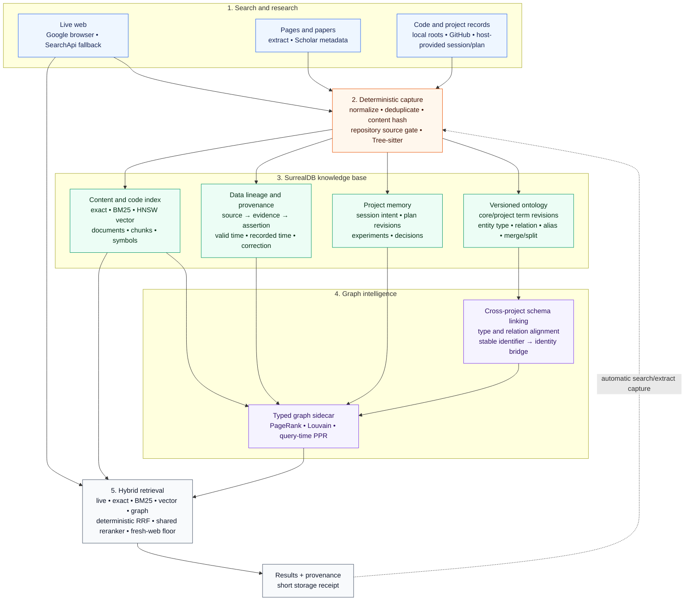

# google-surf-mcp

English | [Korean](./README.ko.md)

[](https://www.npmjs.com/package/google-surf-mcp)
[](https://www.npmjs.com/package/google-surf-mcp)
[](https://github.com/HarimxChoi/google-surf-mcp/actions/workflows/ci.yml)
[](https://mcptoplist.com/server/io.github.HarimxChoi%2Fgoogle-surf-mcp)
[](https://glama.ai/mcp/servers/HarimxChoi/google-surf-mcp)

<p align="center">
  <a href="https://www.searchapi.io/?utm_source=github&utm_medium=sponsorship&utm_campaign=google_search_api&utm_content=HarimxChoi_google-surf-mcp"></a>
</p>
<p align="center">Sponsored by <a href="https://www.searchapi.io/?utm_source=github&utm_medium=sponsorship&utm_campaign=google_search_api&utm_content=HarimxChoi_google-surf-mcp">SearchApi</a></p>

<a href="./assets/graph-pkm.png"></a>

> Web searches, papers, and GitHub repositories are stored as PKM, ontology, and lineage. The view above is generated with `project_memory(action="export", export_format="html", export_view="graph", all_projects=true)`.

*"Turn Google Search, Papers, and Codebases into an Automatic Local Knowledge Graph and lineage for AI Agents with Zero API Key, Zero External Server."*

Google Surf stores search and extraction results in a project-scoped local knowledge graph.

As you search, papers, code, web sources, session intent, plans, experiments, and decisions accumulate in a personal PKM. New research searches stored knowledge and fresh web results together, reducing repeated work while continuing to discover new information.

Projects remain isolated by default. Only verifiable links such as matching DOIs, repository URLs, or explicit aliases are added, so knowledge from one project can be reused in another without merging the original records.

Retrieval runs exact search, BM25, vector search, code and graph search, and live web independently, then combines them with RRF and one shared reranker.

```text
Live web + Papers + Codebases + Project memory
                        ↓
Exact + BM25 + Vector + Code graph + Graph PPR
                        ↓
              RRF + Shared reranker
                        ↓
        Results with evidence and provenance
```

Seven tools are available by default: `search` / `search_parallel` / `extract` / `scholar_search` / `project_memory_search` / `project_memory` / `health`.

Research mode and automatic capture are enabled by default. Set `SURF_RESEARCH=false` to use search and extraction without opening the database or graph sidecar; the project memory tools are not registered in that mode.

Browser search needs no API key. SearchApi can be configured as an optional primary provider or fallback.

## Core features

- **Web, paper, and codebase search:** Google web search is the default, while Scholar is used for paper-specific metadata. SearchApi can act as an optional primary provider or fallback.
- **Web and academic document extraction:** HTML and PDF extraction returns available titles, authors, DOIs, publication metadata, and body text. `search` and `search_parallel` can include abstracts or full bodies.
- **Automatic project memory:** Search results, extracted bodies, and code repositories are stored in the current project. Unread results remain metadata; extracted content becomes active RAG evidence.
- **Structured codebase search:** Tree-sitter links files, symbols, imports, and calls from local projects and relevant GitHub repositories. Exact, BM25, vector, and graph search retrieve the code.
- **Graph hybrid retrieval:** Fresh web results, papers, stored content, codebases, and the project graph are searched independently. Exact, BM25, vector, and PPR candidates are combined through RRF and one shared reranker.
- **Ontology and data lineage:** Web sources, papers, code, plans, experiments, and decisions become typed entities and relations. Evidence paths run from source through documents, chunks, symbols, evidence, and assertions.
- **Cross-project knowledge reuse:** Projects remain isolated but selected projects can be searched together. Only verifiable links connect matching entities.
- **Durable research history:** Session intent, plans, experiments, failures, and decisions supplied by the MCP host are stored as revisions and linked to their supporting evidence.
- **Local graph analysis and export:** PageRank, PPR, connected components, and Louvain communities run without a separate Neo4j server. Results export to HTML, Graphviz, D3 JSON, and Neo4j import formats.

## Search

- API-key-free system Chrome search
- Dedicated logged-out profile that never reads or copies the user's Chrome profile
- Multi-strategy SERP parsing with geometric verification
- Sponsored block and knowledge panel removal
- CAPTCHA detection and environment-specific recovery
- Parser self-healing and context fallback

## Supported AI providers and gateways

- [OrcaRouter](https://www.orcarouter.ai/ref/ref_7fd137d6c7b30793af2f) (free models available)

## Numbers

| | result |
|---|---|
| search | 4.0-5.1s/query |
| scholar_search | 3.8-5.6s/query |

Measured across three uncached queries per provider on a workstation with a 1Gb/s connection. Network and Google response time vary.

## Tech Stack

- **Runtime:** Node.js, TypeScript, Model Context Protocol SDK
- **Web search:** System Chrome + CDP, Playwright compatibility fallback, SearchApi fallback
- **Web extraction:** Mozilla Readability, Turndown
- **PDF extraction:** LiteParse/PDFium, optional OCR, `pdf-lib` metadata parsing
- **Code collection:** Local project roots and gated GitHub sparse download
- **Code parsing:** Tree-sitter for files, symbols, imports, and call relations
- **Code search:** Exact lookup, BM25, Multilingual E5 vector search, and graph PPR
- **Local database:** Embedded SurrealDB on RocksDB
- **Hybrid retrieval:** Live web, papers, project memory, and codebase results combined through RRF
- **Ranking:** Reciprocal Rank Fusion and shared vector reranking
- **Graph analysis:** Graphology, PageRank, PPR, connected components, and Louvain communities
- **Knowledge model:** Versioned ontology, data lineage, cross-project schema and entity linking
- **Recovery:** CAPTCHA recovery, Playwright pool fallback, and deterministic parser self-healing

## Install

Requires Node 20.18.1+. Browser mode also requires Google Chrome or Chromium.

```bash
npx google-surf-mcp   # actual MCP - register in client config
```

First tool call auto-bootstraps the warm profile (you may see Chrome open briefly).

Or local clone:

```bash
git clone https://github.com/HarimxChoi/google-surf-mcp
cd google-surf-mcp
npm install
```

If auto-bootstrap fails (rare), run it manually:
```bash
npm run bootstrap
```

Override paths if needed:
```bash
CHROME_PATH=/path/to/chrome SURF_TZ=America/New_York npm run bootstrap
```

## Use with Claude Code

Paste this into your `~/.claude.json`:

```json
{
  "mcpServers": {
    "google-surf": {
      "command": "npx",
      "args": ["-y", "google-surf-mcp"]
    }
  }
}
```

Restart Claude Code. All seven tools, including `project_memory_search` and `project_memory`, are available by default.

For other MCP clients, use the same JSON shape in their config file.

## Search providers

Browser search remains the default. [SearchApi](https://www.searchapi.io/?utm_source=github&utm_medium=sponsorship&utm_campaign=google_search_api&utm_content=HarimxChoi_google-surf-mcp) can be selected as the primary provider or used only when browser search fails.

| value | behavior |
|---|---|
| `browser` | Default. Uses system Chrome with a dedicated logged-out profile, keeps native search windows hidden, and does not require `SEARCH_API`. Multiple MCP sessions share one local browser broker. |
| `searchapi` | Uses SearchApi as the primary provider and does not initialize Chrome for that tool. |
| `fallback` | Tries the current browser tier once, then uses SearchApi on browser errors, CAPTCHA/rate limits, profile failure, or parser degradation. It does not wait for human CAPTCHA recovery. Successful and normal empty browser responses are not repeated. |

`SURF_SEARCH_PROVIDER` controls `search` and `search_parallel`. `SURF_SCHOLAR_PROVIDER` controls `scholar_search`. SearchApi modes require your own SearchApi account, key, and available credits.

`SURF_BROWSER_ENGINE=auto` selects native Chrome on a local desktop and the Playwright compatibility path in cloud or remote-debug mode. Native mode uses a normal hidden Chrome window, not headless Chrome. Set `native` or `playwright` to pin the engine.

```json
{
  "mcpServers": {
    "google-surf": {
      "command": "npx",
      "args": ["-y", "google-surf-mcp"],
      "env": {
        "SEARCH_API": "your-searchapi-key",
        "SURF_SEARCH_PROVIDER": "fallback",
        "SURF_SCHOLAR_PROVIDER": "searchapi"
      }
    }
  }
}
```

Local clone variant:
```json
{
  "mcpServers": {
    "google-surf": {
      "command": "node",
      "args": ["/abs/path/to/google-surf-mcp/build/index.js"]
    }
  }
}
```

## Tools

- `search(query, limit?, extract_mode?, extract_limit?, response_content?, max_chars?)` - primary single-query tool for live discovery and reading. When new sources must be found and read, set `extract_mode` in this call instead of downloading PDFs, cloning repositories, or calling `extract` separately. Use `extract` only when the exact public URL is already known and no discovery is needed. With `project_id`, stored project knowledge is fused with live results, but the call never becomes local-only. `limit` is 1-20. Extraction defaults to `none`; `extract_limit` is 1-10 with default 5. `response_content` defaults to `full`.
- `scholar_search(query, limit?)` - Google Scholar metadata search, max 10 papers. Supports browser, SearchApi primary, and fallback modes.
- `search_parallel(queries[], limit?, extract_mode?, extract_limit?, response_content?, max_chars?)` - primary multi-query tool for broad live discovery and reading through a continuous four-tab queue. Set `extract_mode` in the same call when public web pages, PDFs, papers, or GitHub repositories must be read. Use local PDF tools only for local files or visual layout work, and clone repositories only for editing, building, testing, or full Git history. `limit` is 1-20 per query. The call-wide `extract_limit` defaults to 12 and allows up to 20 for abstract; full defaults to and allows 10. `response_content` defaults to `summary` to bound one-call output.
- Integrated search extraction reports `requested`, `applied`, `skipped`, `truncated`, and `total_chars`. `remaining_urls` can be passed to `extract` without repeating the search.
- `extract(url, max_chars?, mode?, response_content?)` - secondary extraction tool for an exact public URL when no new discovery is required. If sources still need to be found, use `search` or `search_parallel` with `extract_mode` instead.
  - `mode="full"` (default): reads up to 1000000 characters for research capture. Research mode stores deterministic 4000-character chunks; `response_content="full"` returns up to 50000 characters and `summary` returns a 1500-character evidence excerpt.
  - `mode="abstract"`: ~1500-char survey (PDF page 1 or HTML meta description). Document metadata is included and stored with the survey when research mode is enabled.
  - `mode="metadata"`: metadata without body text. Returns available title, authors, publication, dates, DOI, description, keywords, canonical URL, and PDF properties including page count.
  - GitHub repository URLs read the README in metadata mode. Abstract and full use the same download gate and differ only in indexed source depth.
  - Response: content fields plus available document metadata. Failures return `{ error }`, never throw.
- `project_memory_search(query, query_variants?, project_id?, include_project_ids?, all_projects?, limit?)` - searches stored local knowledge only. Up to 19 optional variants run inside one broker request with batched query embeddings, RRF fusion, evidence-seeded graph expansion, and one final rerank against `query`. Exact identifiers and quoted phrases are added deterministically. Use this instead of repeated terminal calls. It never opens a browser or calls Google or SearchApi.
- `project_memory(action, ...)` - manages durable project knowledge when `SURF_RESEARCH=true`.
  - `action="search"`: compatibility alias for `project_memory_search`.
  - `action="export"`: writes a standalone interactive HTML explorer, Graphviz DOT, D3 node-link JSON, or a Neo4j import bundle under `<research-root>/exports`.
- `health()` - server status, including the local research runtime.

| Need | Tool |
|---|---|
| Search only previously stored research and project memory | `project_memory_search` |
| Find new information on the web | `search` |
| Compare new web results with stored project knowledge | `search` with `project_id` |
| Run several new web queries | `search_parallel` |

## Replayable research collection

`google-surf-collect` runs a versioned JSON specification through one persistent MCP session. A specification can mix live `search` jobs with local-only `project_memory_search` jobs. Live jobs can extract bodies in the same call, while local jobs reuse indexed project knowledge without opening Google.

```bash
npx google-surf-collect examples/research-collection.example.json
```

From a source checkout:

```bash
npm run build
npm run research:collect -- examples/research-collection.example.json
```

A project workflow can also record durable sessions and plans, rebuild approved code roots, search the resulting local knowledge, and export its graph:

```bash
npm run research:collect -- examples/project-memory-workflow.example.json
```

`project_memory` collection jobs allow `record`, `rebuild`, and `export`. Destructive `forget` operations are not accepted by the collection schema. Project-level `project_id` is inherited by every job unless an all-project export is requested.

The output is append-only JSONL. Its manifest records the normalized specification hash, package version, Git commit, Node runtime, platform, project setup, and server health. Every search, record, rebuild, and export result records the stable job id, exact tool arguments, attempt, timestamps, elapsed time, response, and error state. Successful jobs are skipped on resume; failed jobs are retried. A changed specification requires a new output file. Set `project_name` with `project_id` when the runner should create a missing project; existing projects are reused.

Set `retrieval_mode` to `live` when prior project RAG state must not affect live result ranking. Results are still captured under `project_id`. Use `hybrid` when the collection intentionally ranks new web evidence together with stored project knowledge. API keys and environment variable values are never written to the collection log.

This makes the collection procedure and returned snapshot replayable and auditable. Live web results can still change with time, locale, network route, and upstream ranking.

## Graph hybrid RAG with ontology and lineage



### One local knowledge base

One SurrealDB instance persistently stores web results, papers, code, sessions, plans, experiments, decisions, ontology, and provenance. A single local research broker owns the embedded RocksDB connection. Multiple MCP sessions connect to it through authenticated local IPC, run reads concurrently, and order writes without opening the database themselves. Graph projections and analytics such as PageRank and communities are derived data that can be rebuilt from source hashes and ontology versions.

### Ontology and cross-project links

The versioned ontology preserves entity type and relation changes as revisions. Schema linking aligns project-specific types and relations with the shared schema. Entity linking connects the same paper, repository, or entity only when verifiable identifiers such as a DOI, repository URL, or explicit alias match. Ambiguous candidates are not linked automatically.

### Data and research lineage

- **Source lineage:** `source → document → chunk → evidence → assertion`
- **Code lineage:** `repository → directory → file → symbol → import/call`
- **Research lineage:** `session → intent → plan revision → experiment → decision`

This preserves the evidence behind claims and decisions while retaining corrected or superseded history.

### Graph retrieval

Graphology builds a typed graph projection from SurrealDB and computes PageRank, connected components, and Louvain communities. At retrieval time, related nodes seed PPR-based multi-hop search. Live web, exact, BM25, vector, and graph candidates are combined through deterministic RRF and one shared reranker.

Local multi-query retrieval batches query embeddings, fuses lexical and vector candidates first, expands the graph once, hydrates selected chunks once, and reranks once. Graph-only all-project searches use a lightweight memory-node index and verified identity aliases to select at most four graph scopes instead of constructing every project graph at query time.

### Project isolation and knowledge reuse

`project_id` selects where new results are stored. `include_project_ids` expands the read scope without changing the write target. Original records remain isolated by project, while verified schema and entity links allow papers, code, and experiment results to be reused across selected projects.

### Interactive graph and export

Use `project_memory(action="export", export_format="html", export_view="graph")`. The returned standalone HTML opens locally without a server and contains three coordinated views. Use `project_id` for one project, `include_project_ids` for a selected combined graph, or `all_projects=true` for every project.

- **PKM** groups the integrated project graph by community and sizes nodes by PageRank.
- **Lineage** separates source and code lineage from session, intent, plan, experiment, and decision lineage while keeping both flows aligned by stage.
- **Ontology** shows core types and relations, aligned shared schema, and typed instances. A verified identity layer appears only when stable identifiers or explicit aliases prove a cross-project match.

<table>
  <tr>
    <td width="50%" align="center">
      <a href="./assets/graph-lineage.png"></a><br />
      <strong>Data and research lineage</strong>
    </td>
    <td width="50%" align="center">
      <a href="./assets/graph-ontology.png"></a><br />
      <strong>Ontology and shared schema</strong>
    </td>
  </tr>
</table>

Search, type filters, one to three hop local focus, pan, zoom, and the provenance inspector work inside the file. Large graphs use a deterministic semantic projection that balances node type, PageRank, degree, and community coverage. The viewer reports source and displayed counts, replaces internal IDs with local aliases, disambiguates repeated labels, and does not embed source IDs, local paths, node bodies, plan text, or evidence quotes.

The project menu switches between every project embedded in the export and an integrated `All projects` view. Use `all_projects=true` when exporting to include every named project in the local database, or use `project_id` and `include_project_ids` for a bounded set. Clicking empty canvas space clears local node focus. PNG exports the current canvas, while JSON exports the current tab, project, type filters, and local focus using only the anonymized viewer payload. The standalone file has a nonce-bound script CSP, makes no network connections, and permits source links only for stripped public HTTP or HTTPS URLs.

#### Neo4j export

Use `project_memory(action="export", export_format="neo4j", export_view="graph")`. The returned directory contains `nodes.csv`, `relationships.csv`, `constraints.cypher`, `load.cypher`, `manifest.json`, and `README.txt`. PageRank, community, ontology, lineage, project IDs, source IDs, and evidence IDs are preserved. Node bodies, plan text, and evidence quotes are not exported.

For a new or empty local database, run the Neo4j offline importer from the export directory:

```powershell
neo4j-admin database import full --nodes=nodes.csv --relationships=relationships.csv neo4j
```

For an existing local database, copy both CSV files to the Neo4j import directory, then run:

```powershell
cypher-shell -f constraints.cypher
cypher-shell -f load.cypher
```

The offline importer creates typed node labels and relationship types. The online loader uses `SurfNode` and `SURF_RELATION`, retaining the original kinds and relationship types as properties. `neo4j-admin database import full` is intended for a new or empty database; use `LOAD CSV` for an existing database. See the official [Neo4j import](https://neo4j.com/docs/operations-manual/current/import/) and [LOAD CSV](https://neo4j.com/docs/cypher-manual/current/clauses/load-csv/) documentation. Bolt is a connection protocol, not an export file format, so this command does not connect to or modify a Neo4j server.

### Storage scope and security

Research mode is enabled by default. `search`, `search_parallel`, `scholar_search`, and `extract` results are captured automatically. Session intent, plans, experiments, and decisions are stored only when the MCP host sends them through `project_memory`; versioning, ontology mapping, and lineage linking then run automatically. Retrieval mode is server configuration, not a per-call argument.

Image retrieval, image embeddings, and visual reranking are not part of research memory. OCR is used only to recover searchable text from scanned PDF pages.

Credential and private-key files are excluded from body indexing. HTML exports omit source IDs, local paths, node bodies, plan text, and evidence quotes. The viewer initiates no network requests and opens stripped public HTTP or HTTPS source links only after user action.

Project and assertion deletion require a count preview and confirmation token. They create reversible tombstones and preserve evidence and correction history. Fact correction takes only `target_id`, `replacement`, and `reason`; the prior assertion remains as bitemporal history. Plan revisions are append-only. Experiments are bound to the active revision and must be finished explicitly as `success`, `failed`, or `inconclusive`. Logs are not used to infer an outcome. Receipts list stored categories only:

```text
Project: Graph memory | Session: temporal graph research | Stored: paper 1 (Graphiti), repo 1 (getzep), search summaries 3 | Status: ready
```

Set `SURF_RESEARCH=false` to keep the database and sidecar closed and omit `project_memory_search` and `project_memory`. Obsidian and Notion sync are not included and will remain project-level opt-in when added.

## Env vars

| var | default | notes |
|---|---|---|
| `SEARCH_API` | unset | SearchApi API key. Required only when either provider setting is `searchapi` or `fallback`. Sent as a bearer token and never placed in the request URL. |
| `SEARCHAPI_API_KEY` | unset | Alias for `SEARCH_API`. |
| `SURF_SEARCH_PROVIDER` | `browser` | Provider for `search` and `search_parallel`: `browser`, `searchapi`, or `fallback`. |
| `SURF_SCHOLAR_PROVIDER` | `browser` | Provider for `scholar_search`: `browser`, `searchapi`, or `fallback`. |
| `SURF_BROWSER_ENGINE` | `auto` | Browser engine: `auto`, `native`, or `playwright`. Native Chrome performs the request before read-only CDP attachment. |
| `CHROME_PATH` | auto-detected | absolute path to Chrome binary |
| `SURF_PROFILE_ROOT` | `~/.google-surf-mcp` | where the warm profile lives |
| `SURF_RESEARCH` | `true` | enables local project memory, capture, indexing, `project_memory_search`, and `project_memory`; set `false` for search and extraction only |
| `SURF_RETRIEVAL_MODE` | `hybrid` | research search route: `live` or `hybrid`; used only when `SURF_RESEARCH=true` |
| `SURF_RESEARCH_ROOT` | `<profile>/research` | embedded SurrealDB data directory |
| `SURF_RESEARCH_VECTOR_MODEL` | `Xenova/multilingual-e5-small` | local 384-dimensional model used by HNSW vector retrieval and final reranking. The default model revision is pinned; `off` disables the vector lane. |
| `SURF_RESEARCH_VECTOR_LOW_MEMORY` | `true` | disables the ONNX CPU memory arena and memory pattern; set `false` to trade higher peak memory for faster initial indexing |
| `SURF_RESEARCH_VECTOR_THREADS` | `4` | ONNX intra-op thread count, clamped to 1-16 |
| `SURF_RESEARCH_REPO_AUTO` | `true` | automatically sparse-index at most one small, relevant GitHub repository per search call |
| `SURF_RESEARCH_REPO_AUTO_MAX_MB` | `20` | maximum searchable source-text size for automatic GitHub indexing; assets are excluded |
| `SURF_RESEARCH_REPO_AUTO_MAX_FILES` | `2000` | maximum searchable source file count for automatic GitHub indexing |
| `SURF_RESEARCH_BROKER_IDLE_MS` | `60000` | how long the shared research broker remains available after the last client disconnects |
| `SURF_RESEARCH_READ_CONCURRENCY` | `4` | maximum concurrent broker reads; identical in-flight reads share one operation |
| `SURF_RESEARCH_QUERY_TIMEOUT_MS` | `30000` | embedded SurrealDB query timeout, clamped to 1-600 seconds |
| `GITHUB_TOKEN` | unset | optional GitHub token that raises API limits for repository inspection |
| `SURF_RESEARCH_CODE_WORKERS` | auto, max 4 | Tree-sitter worker count for initial code structure indexing |
| `SURF_LOCALE` | `en-US` | browser locale |
| `SURF_TZ` | system tz | e.g. `America/New_York` |
| `SURF_HEADLESS` | `true` | Controls Playwright extraction, compatibility, and recovery paths. Native search keeps a normal system Chrome window hidden and shows it only for CAPTCHA recovery. |
| `SURF_REMOTE_DEBUG` | `false` | set `true` on a headless server with remote DevTools. CAPTCHA path emits the DevTools port and throws instead of spawning a window; attach `chrome://inspect` from a local machine over SSH port-forward to solve. |
| `SURF_CAPTCHA_TIMEOUT_MS` | `180000` | lifetime of the background human-recovery window. MCP calls return immediately and do not wait for this timeout. |
| `SURF_IDLE_CLOSE_MS` | `30000` | idle ms before closing the sequential ctx and pool. `0` disables idle auto-close. Lower = faster cleanup, higher = warmer cache for spaced-out calls. |
| `SURF_ALLOW_PRIVATE` | `false` | set `true` to allow `extract` to fetch private/loopback addresses (`localhost`, `127.0.0.1`, `10.x`, `192.168.x`, `169.254.x`, etc). Default blocks them as an SSRF guard. |
| `SURF_EXTRACT_MAX_CHARS` | `50000` | full extraction limit (200-50000); abstract defaults to 1500 and per-call `max_chars` overrides both |
| `SURF_EXTRACT_OCR` | `false` | OCR scanned/image PDFs via Tesseract (slower; off by default) |
| `SURF_CLOUD_MODE` | `false` | headless/serverless mode: TLS bypass + `--no-sandbox` + `--disable-dev-shm-usage` + worker pool disabled + fail-fast on CAPTCHA |
| `SURF_CASCADE_DISABLED` | `false` | pin a single stealth mode (chosen by `SURF_USE_STEALTH`) instead of the 3-tier auto-cascade |
| `SURF_USE_STEALTH` | `true` | initial stealth tier; only consulted when `SURF_CASCADE_DISABLED=true` |
| `SURF_HUMANLIKE_MODE` | `background` | `off` / `background` (fire-and-forget after returning results) / `inline` (await before returning, slower) |
| `SURF_RATE_LIMIT_PER_MIN` | `10` | internal cap on Google-facing requests per minute |
| `SURF_CACHE_TTL_SEARCH_MS` | `86400000` | search cache TTL (24h); `0` disables caching |
| `SURF_CACHE_MAX_ENTRIES` | `1000` | LRU cap per cache namespace |
| `SURF_CACHE_ROOT` | `<profile>/cache` | cache directory |
| `SURF_INSECURE_TLS` | `=SURF_CLOUD_MODE` | `--ignore-certificate-errors` (auto-on in cloud mode) |
| `SURF_NO_SANDBOX` | `=SURF_CLOUD_MODE` | `--no-sandbox` (auto-on in cloud mode) |
| `SURF_TELEMETRY` | `false` | set `true` to enable jsonl event logging (search outcomes, cache hits/misses, tool errors, parser staleness) under `{SURF_TELEMETRY_ROOT}`. Designed as the input feed for the self-healing pipeline. Off by default. |
| `SURF_TELEMETRY_ROOT` | `<profile>/telemetry` | directory for jsonl telemetry files. UTC-dated one file per day (`YYYY-MM-DD.jsonl`). |
| `SURF_SELF_HEALING` | `true` | per-strategy outcome tracking + persisted reordering. Healing must win by 3 outcomes before reorder kicks in, so single-call flapping is impossible. Set `false` to pin the default strategy order. |
| `SURF_SELF_HEALING_FILE` | `<profile>/.heal/strategy-order.json` | persistence path for healing state. Atomic tmp+rename writes; debounced 5s. |
| `SURF_LLM_HEAL` | `false` | opt-in for LLM-assisted selector repair in the workflow-only `repairWithLLM` helper. Off by default, so no third-party LLM request fires. |
| `SURF_LLM_PROVIDER` | `anthropic` | LLM repair provider: `anthropic` or `orcarouter`. |
| `SURF_LLM_MODEL` | provider default | model for LLM-assisted repair. Defaults to `claude-sonnet-4-6` for Anthropic and `orcarouter/auto` for OrcaRouter. |
| `ANTHROPIC_API_KEY` | unset | Anthropic key used only when LLM repair is enabled with the Anthropic provider. |
| `ORCAROUTER_API_KEY` | unset | OrcaRouter key used only when LLM repair is enabled with the OrcaRouter provider. |
| `ORCA_KEY` | unset | Alias for `ORCAROUTER_API_KEY`. |

### OrcaRouter

```env
SURF_LLM_HEAL=true
SURF_LLM_PROVIDER=orcarouter
ORCAROUTER_API_KEY=...
SURF_LLM_MODEL=orcarouter/auto
```

## Troubleshooting

- Native search keeps the current session open and shows Chrome when a CAPTCHA appears. Solve it in that window and retry; the next call verifies the page, restores the hidden window guard, and continues with the same session. SearchApi fallback remains available through `SURF_SEARCH_PROVIDER=fallback` and `SURF_SCHOLAR_PROVIDER=fallback`.
- Playwright CAPTCHA recovery has 4 modes (picked automatically from env):
  - default (local desktop): OS notification fires, headed Chrome opens, and the call returns; solve it and retry
  - `SURF_HEADLESS=false`: headed Chrome opens without a notification; solve it and retry
  - `SURF_REMOTE_DEBUG=true`: DevTools port + instructions printed, attach `chrome://inspect` locally to solve
  - `SURF_CLOUD_MODE=true`: fail-fast with `CAPTCHA_REQUIRED` error
- **Headed Chrome opens to a plain search box instead of CAPTCHA**: just type any query in the box and press Enter. Subsequent calls work.
- "Chrome not found": install Chrome or set `CHROME_PATH`.
- Stale selectors: runtime per-strategy reorder (`SURF_SELF_HEALING`, deterministic) plus a manually dispatched repair workflow (`SURF_LLM_HEAL` optional, human review required, never auto-merged).
- Playwright searches feel slower than expected: check `health().pool.fallback`. `true` means the worker pool is using a single context. Native search uses one authenticated local browser broker across MCP sessions. The broker keeps one hidden Chrome process with up to four reusable tabs for `search`, `search_parallel`, and `scholar_search`. Query starts are staggered. A CAPTCHA shows and preserves that session for user recovery, then the window guard is restored on the next call. A browser crash starts a new session on the next call.
- SSRF: `extract` blocks `localhost`, private IPs, AWS metadata by default. Set `SURF_ALLOW_PRIVATE=true` to allow them.
- Cache cleanup: `npm run cache:clear` removes search/extract and downloaded vector-model caches. It does not remove the research DB.
- The local research DB is not application-encrypted. Use OS account permissions and disk encryption such as BitLocker or FileVault when the machine or backups need at-rest protection.

## Changelog

See [CHANGELOG.md](./CHANGELOG.md).

## License

MIT
